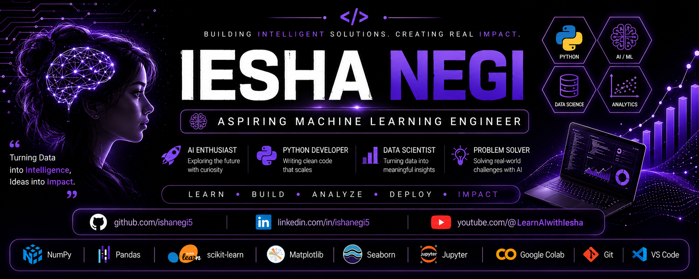

  

<!-- ========================= PROFILE BANNER ========================= -->

<h1 align="center">Hi 👋, I'm Iesha Negi</h1>

<h3 align="center">
Aspiring Machine Learning Engineer | Python Developer | AI Educator
</h3>

🎓 B.Tech Computer Science & Engineering (3rd Year)

📍 Dehradun, Uttarakhand, India

🚀 Passionate about Artificial Intelligence, Machine Learning & Data Science

---

# 👩‍💻 About Me

- 🎓 B.Tech CSE (3rd Year)
- 🤖 Aspiring Machine Learning Engineer
- 🐍 Strong in Python
- 📊 Skilled in NumPy, Pandas, Matplotlib, Seaborn
- 🧠 Machine Learning using Scikit-Learn
- 📈 Love solving real-world ML problems
- 🎥 Creator of **Learn AI with Isha**
- 🌱 Currently learning **XGBoost, Deployment, Docker & MLOps**

---

# 🚀 Tech Stack

### Programming Language

---

### Machine Learning

---

### Data Analysis

---

### Tools

---

# 📊 GitHub Stats

---

# 🏆 Featured Machine Learning Projects

## ❤️ Heart Disease Prediction

✔ Random Forest Classifier

✔ Accuracy: **93%**

✔ Feature Importance

✔ Data Preprocessing

---

## 📱 Mobile Price Prediction

✔ Random Forest

✔ Classification

✔ Feature Engineering

---

## 📉 Telecom Customer Churn Prediction

✔ Logistic Regression

✔ Recall: **60%**

✔ Precision-Recall Analysis

✔ Confusion Matrix

---

## 🧠 Tumor Detection

✔ Logistic Regression

✔ Accuracy: **98%**

✔ Binary Classification

---

# 🏅 GitHub Achievements

---

# 📈 Contribution Graph

---

# 🌱 Currently Learning

- 🤖 Deep Learning
- 🚀 Model Deployment
- 🐳 Docker
- ⚡ FastAPI
- ☁️ Cloud Basics (AWS)
- 📊 XGBoost
- 🧠 Neural Networks
- 🔥 MLOps Fundamentals

---

# 🎯 2026 Goals

✅ Become Job Ready in Machine Learning

✅ Build 15+ End-to-End ML Projects

✅ Learn Deep Learning

✅ Learn MLOps

✅ Contribute to Open Source

✅ Crack an ML Internship

---

# 📚 Featured Repositories

| Project | Description |
|----------|-------------|
| ❤️ Heart Disease Prediction | Random Forest model with feature importance |
| 📱 Mobile Price Prediction | Classification model using Scikit-Learn |
| 📉 Telecom Customer Churn | Logistic Regression with recall optimization |
| 🧠 Tumor Detection | Benign vs Malignant classification |

---

# 📺 YouTube

🎥 **Learn AI with Iesha**

I regularly upload tutorials on:

- Python
- Machine Learning
- AI
- Mathematics for ML
- Interview Preparation

⭐ **Subscribe:** https://www.youtube.com/@LearnAIwithIesha

---

# 🌐 Connect With Me

---

# 💡 Favorite Quote

> **"Success comes from consistency, not perfection."**

---

⭐ If you like my work, consider giving a ⭐ to my repositories!

Thanks for visiting my profile! 😊

